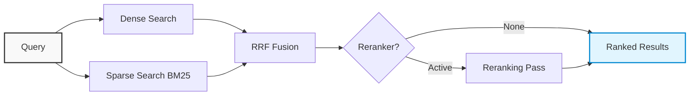

<div align="center">
  <picture>
    <source media="(prefers-color-scheme: dark)" srcset="assets/banner-dark.svg">
    <source media="(prefers-color-scheme: light)" srcset="assets/banner-light.svg">
    
  </picture>

  <p><strong>Hybrid retrieval (dense + sparse + RRF fusion + optional reranking) for RAG pipelines.</strong></p>
  
  <p>Most RAG setups search with dense embeddings alone. RankFuse adds keyword-aware hybrid search without pulling in a full framework.</p>

  <p>
    <a href="https://pypi.org/project/rankfuse/"></a>
    <a href="https://pypi.org/project/rankfuse/"></a>
    <a href="https://github.com/GauravFrr/RankFuse/blob/main/LICENSE"></a>
    <a href="https://github.com/GauravFrr/RankFuse/actions/workflows/test.yml"></a>
    <a href="https://pypi.org/project/rankfuse/"></a>
  </p>

  <p>
    <a href="docs/architecture.md">Docs</a> •
    <a href="docs/api_reference.md">API Reference</a> •
    <a href="benchmarks/results.md">Benchmark</a> •
    <a href="https://pypi.org/project/rankfuse/">PyPI</a> •
    <a href="https://github.com/GauravFrr/RankFuse/issues">Issues</a>
  </p>
</div>

---

### Features

<table>
  <tr>
    <td width="33%"><strong>🔍 Hybrid Search</strong><br>Dense + sparse + RRF fusion for optimal semantic and exact-term retrieval.</td>
    <td width="33%"><strong>🎯 Pluggable Reranking</strong><br>Precision pass via local cross-encoders, Gemini LLM-judges, or direct RRF output.</td>
    <td width="33%"><strong>🔌 Swappable Components</strong><br>Bring your own embedding models or vector stores using simple interface overrides.</td>
  </tr>
  <tr>
    <td width="33%"><strong>📦 Lightweight Core</strong><br>Lean ~20MB default install. PyTorch and heavy model dependencies are optional extras.</td>
    <td width="33%"><strong>🔑 BYOK &amp; Local First</strong><br>Runs directly inside your application process. No extra infrastructure or managed services.</td>
    <td width="33%"><strong>📊 Honest Benchmarks</strong><br>Honest evaluation details, diagnostic trade-offs, and corpus recall statistics.</td>
  </tr>
</table>

<details>
  <summary><strong>Table of Contents</strong></summary>
  <ul>
    <li><a href="#-install">📦 Install</a></li>
    <li><a href="#-quickstart">🚀 Quickstart</a></li>
    <li><a href="#-what-it-does">🔍 What it does</a></li>
    <li><a href="#-reranker-options">🎯 Reranker options</a></li>
    <li><a href="#-benchmark">📊 Benchmark</a></li>
    <li><a href="#-swap-in-your-own-embedder-or-store">🔌 Swap in your own embedder or store</a></li>
    <li><a href="#-docs">📚 Docs</a></li>
    <li><a href="#-contributing">🤝 Contributing</a></li>
    <li><a href="#-license">📄 License</a></li>
  </ul>
</details>

---

## 📦 Install

```bash
pip install rankfuse
```

Lightweight install (~20MB): pulls in `chromadb`, `rank-bm25`, `google-genai`, and `pydantic`. No PyTorch or GPU binaries. Uses Gemini for embeddings and the optional LLM-judge reranker.

To use the local cross-encoder reranker (adds `sentence-transformers` + PyTorch, ~1-2GB on first use):

```bash
pip install rankfuse[cross-encoder]
```

Requires Python 3.10+. You'll need a [Gemini API key](https://aistudio.google.com/app/apikey) for embeddings.

---

## 🚀 Quickstart

```python
from rankfuse import Retriever, RetrieverConfig

config = RetrieverConfig(
    embedder_provider="gemini",
    api_key="your-gemini-api-key",  # or set GEMINI_API_KEY env var
    persist_dir="./my_index",
    reranker_type="cross_encoder",  # or "llm_judge", or "none"
)

retriever = Retriever(config)

retriever.ingest([
    {"id": "doc1", "text": "Refunds are processed within 5-7 business days.", "metadata": {"source": "faq"}},
    {"id": "doc2", "text": "To reset your password, go to Settings > Security.", "metadata": {"source": "faq"}},
    {"id": "doc3", "text": "Check order status by logging into your dashboard.", "metadata": {"source": "faq"}},
])

results = retriever.search("what is the refund policy?", top_k=5)

for r in results:
    print(r.doc_id, r.score, r.text[:80])
```

Run the full working example:

```bash
GEMINI_API_KEY=your-key python examples/quickstart.py
```

---

## 🔍 What it does



Standard RAG pipelines search with dense embeddings only. Dense embeddings are good at semantic similarity but miss exact keyword matches — a query for `"RFC 7231"` won't reliably surface a document that only contains the literal text `"RFC 7231"` unless the embedding space happens to capture it.

RankFuse adds a BM25 sparse index alongside the dense index, runs both in parallel, and merges the results using Reciprocal Rank Fusion (RRF). RRF works on rank position rather than raw scores, so it doesn't require normalization between the two score scales — it's simple and robust.

Optionally, a reranker (local cross-encoder or Gemini LLM-judge) does a precision pass over the fused top-N candidates before returning the final results.

---

## 🎯 Reranker options

| Type (`reranker_type`) | Underlying Model / Method | Operational Cost / Trade-off |
|---|---|---|
| **`"cross_encoder"`** | `ms-marco-MiniLM-L-12-v2` (Local execution) | **Free** (Offline, triggers one-time ~200MB download) |
| **`"llm_judge"`** | Gemini Generative API | **API quota cost** (Incurs API request per candidate) |
| **`"none"`** | RRF output ranking directly | **Free** (No additional overhead, returns fused ranks) |

> [!TIP]
> **Recommendation:** Use `"cross_encoder"` for zero-cost local prototyping and production setups requiring low latency/offline runs. Use `"llm_judge"` for highest precision where rich LLM context is required.

---

## 📊 Benchmark

Evaluated on 30 queries over the full FastAPI documentation corpus (154 documents). Hybrid search with stopword-filtered BM25 closes the candidate recall gap versus dense-only search — hybrid RRF-only matches dense-only at Recall@5 (0.90) while also providing exact-term coverage dense alone misses.

The standard equal-weight RRF configuration doesn't improve Recall@1 on this particular corpus — the release notes document causes keyword concentration that inflates BM25 scores for non-tutorial results. See [`benchmarks/results.md`](benchmarks/results.md) for the full methodology, diagnostic breakdown, and honest discussion of where hybrid search helps and where it doesn't.

---

## 🔌 Swap in your own embedder or store

```python
from rankfuse.embeddings.base import Embedder

class MyEmbedder(Embedder):
    def embed(self, texts: list[str]) -> list[list[float]]:
        # your embedding logic here
        ...

retriever = Retriever(config, embedder=MyEmbedder())
```

See [`examples/custom_embedder.py`](examples/custom_embedder.py) for a full working example.

---

## 📚 Docs

- [Architecture](docs/architecture.md) — how the components connect
- [API Reference](docs/api_reference.md) — full config fields and method signatures
- [Benchmark Results](benchmarks/results.md) — methodology and findings
- [FastAPI integration example](examples/fastapi_integration.py)

---

## 🤝 Contributing

We welcome contributions of all kinds! Please see [CONTRIBUTING.md](CONTRIBUTING.md) for local development setup guide, test execution instructions, and code submission guidelines. Feel free to open issues or submit Pull Requests.

---

## 📄 License

MIT

---

<div align="center">
  <sub>Built by <a href="https://github.com/GauravFrr">Gaurav</a> — generalized from production RAG patterns in <a href="https://github.com/GauravFrr/Retryv">Retryv</a></sub>
</div>
